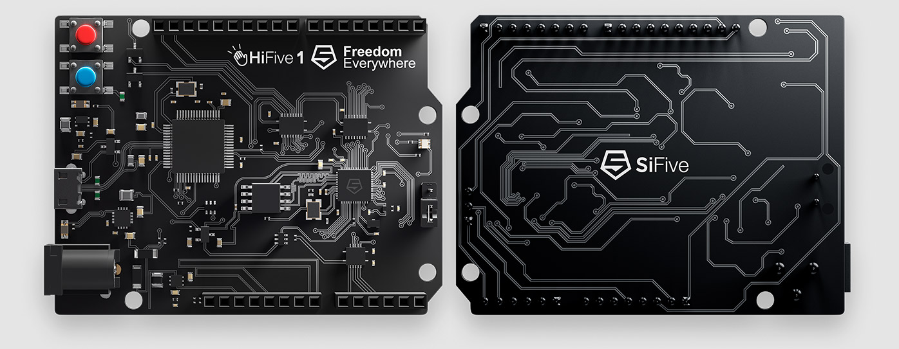

# HIFive1 RevB

[HIFive RevB のページ](https://www.sifive.com/boards/hifive1-rev-b)

---

# HIFive1 RevB

* Hifive1
  * RV32IMAC
* Rust
  * riscv32imac-unknown-none-elf

このボード向けにコンパイルできるのでは？

---

# やってみた
 * C言語からRustを呼び出す
 * Rust単体で実行する

